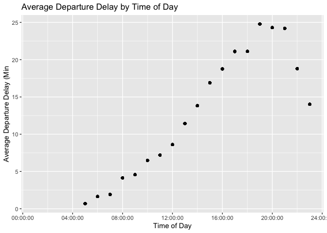
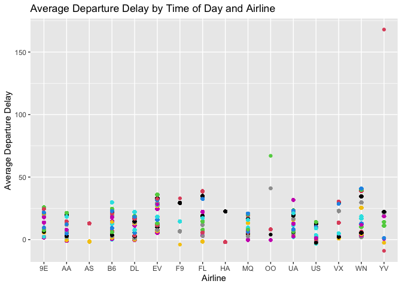
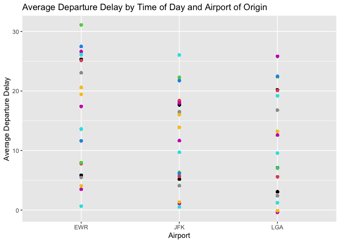
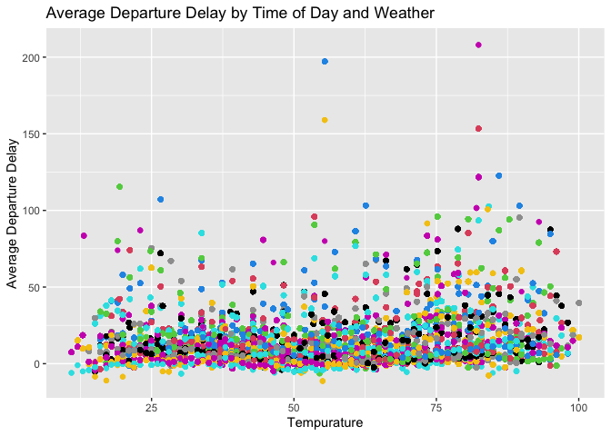

BigFlightHmwk
================

To answer the question what time of day I should fly to avoid delays as
much as possible we look at some flights data. I chose departure delay
instead of arrival delay because I am more personally concerned about
that than arrival. Based on my analysis I concluded that the only factor
that considerably effects the departure time delay is the time of day in
which you fly. I found no significant looking correlation with Airline,
Origin or Temperature and their effects on average departure time.

The first thing I want to analyze is the time-of-day vs delay. I
included the head of this data set in order to provide the reader with a
better idea of the data I am working with. To begin this, I plotted a
graph to show any visible relationship between these variables.

    ## # A tibble: 6 x 21
    ## # Groups:   time [2]
    ##    year month   day dep_time sched_dep_time dep_delay arr_time sched_arr_time
    ##   <int> <int> <int>    <int>          <int>     <dbl>    <int>          <int>
    ## 1  2013     1     1      517            515         2      830            819
    ## 2  2013     1     1      533            529         4      850            830
    ## 3  2013     1     1      542            540         2      923            850
    ## 4  2013     1     1      544            545        -1     1004           1022
    ## 5  2013     1     1      554            600        -6      812            837
    ## 6  2013     1     1      554            558        -4      740            728
    ## # … with 13 more variables: arr_delay <dbl>, carrier <chr>, flight <int>,
    ## #   tailnum <chr>, origin <chr>, dest <chr>, air_time <dbl>, distance <dbl>,
    ## #   hour <dbl>, minute <dbl>, time_hour <dttm>, time <time>, avg_delay <dbl>

<!-- -->

From this graph we can see a relationship between Time of Day and
Average Departure Delay in minutes. From the graph we can conclude that
if you want to avoid delays as much as possible you should fly before
noon. The average Departure delay is bout -5 minutes, meaning leaving
early, if you fly before 8am, close to an on time departure if you leave
between 8am and noon.

Next let’s look at another factor that may affect departure delays. Does
Airline effect the average departure delay? I included the code for this
section in order to display how I am piping variables. All of my
sections are similar to this and vary by only a variable or two. Let’s
plot some data and see:

``` r
#AVG DELAY BY CARRIER
flights %>% mutate(time = as_hms(ymd_hms(time_hour)))%>%
  group_by(time, carrier) %>% mutate(avg_delay=mean(dep_delay, na.rm = T)) %>% 
  ggplot(mapping = aes(y=avg_delay, x = carrier, color = time) ) + geom_point() + 
  ggtitle("Average Departure Delay by Time of Day and Airline") + ylab("Average Departure Delay") + xlab("Airline")
```

<!-- -->

This data doesn’t display a super clear relationship, we can infer some
things about it though. Most airlines appear to be consistent with some
departure delay minutes, most lying in between 0 to 25 minutes.

Now we look at if Airport perhaps effects departure delay:

<!-- -->

From this graph I can see no clear pattern, I conclude that airport does
not have a large effect on departure delay.

Now I explore if temperature had is a factor of departure delay:

    ## Joining, by = c("year", "month", "day", "origin", "hour", "time_hour")

<!-- -->

From this graph I see no clear pattern to indicate significant effect,
though it is interesting to look at. Visually it looks like the flights
from 25 to 50 degrees looks more compact than the flights between 75 to
100 degrees.
